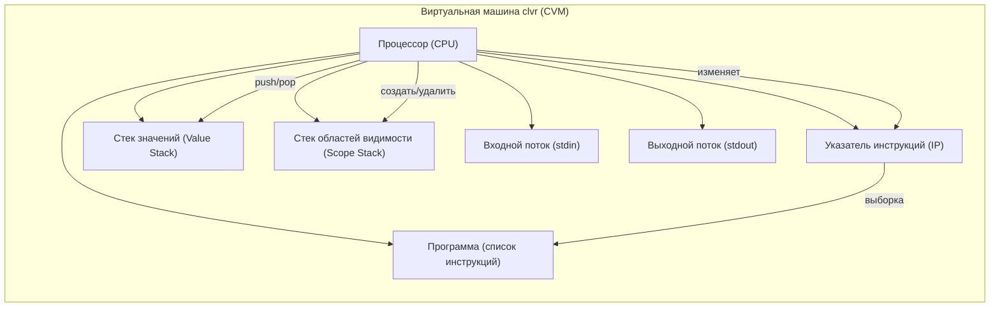

# Виртуальная машина clvr

Виртуальная машина **CVM** (Clvr Virtual Machine) выполняет инструкцию за инструкцией, реализуя семантику языка clvr. Данная спецификация описывает модель, структуру и набор инструкций CVM.

## Иллюстрация

Структура виртуальной машины:

## Система инструкций

Ниже представлен полный список инструкций виртуальной машины clvr.

### Базовые инструкции (1–17)

1. PushInt <Value> — Помещает целочисленный литерал `Value` на стек значений.
2. PushFloat <Value> — Помещает вещественный литерал `Value` на стек значений.
3. PushString <Value> — Помещает строковый литерал `Value` на стек значений.
4. PushBool <Value> — Помещает булев литерал на стек. `Value` = 0 ("false") или 1 ("true").
5. Add — Снимает два значения со стека (EVAL[^2] и EVAL[^1]). Вычисляет EVAL[^2] + EVAL[^1].  
   Оба операнда должны быть одного типа:
   - int + int = int
   - float + float = float
   - string + string = string (конкатенация)  
     При несовпадении типов — ошибка выполнения. Результат помещается на стек.
6. Subtract — Снимает два значения (EVAL[^2] и EVAL[^1]). Вычисляет EVAL[^2] - EVAL[^1]. Только для чисел. Оба операнда одного типа. Результат на стек.
7. Multiply — Снимает два значения. Вычисляет EVAL[^2] * EVAL[^1]. Только для чисел. Оба операнда одного типа. Результат на стек.
8. Divide — Снимает два значения. Вычисляет EVAL[^2] / EVAL[^1]. Только для чисел. Оба операнда одного типа:
   - Для int — целочисленное деление (дробная часть отбрасывается).
   - Для float — вещественное деление.  
     Деление на ноль — ошибка.
9. Mod — Снимает два значения. Вычисляет EVAL[^2] % EVAL[^1]. Только для int. Деление на ноль — ошибка.
10. UnaryMinus — Снимает вершину стека (EVAL[^1]), которая должна быть числом. Помещает -значение того же типа на стек.
11. DefineVariable <VariableDefinition> — Создаёт новую переменную. Значение с вершины стека (снимается).  
    VariableDefinition содержит: Name, Type (Int, Float, String, Bool), IsConstant.  
    Ошибка, если переменная уже существует в текущей области видимости.
12. LoadVariable <Name> — Ищет переменную Name во всех активных областях видимости (от текущей к родительским). Если найдена, помещает её значение на стек. Ошибка, если переменная не существует.
13. StoreVariable <Name> — Записывает значение с вершины стека в существующую переменную Name (не константу). Значение снимается. Ошибка, если переменная не найдена или является константой.
14. Input <Name> — Читает строку из stdin, преобразует к типу переменной Name и записывает.  
    Для bool: "true" → true, "false" → false , иначе ошибка.  
    Ошибки: переменная не существует, константа, конец потока, неверное преобразование.
15. Output — Снимает значение с вершины стека и выводит его текстовое представление в stdout. Для bool выводится "true" или "false".
16. EnterScope — Создаёт новую пустую область видимости (поверх текущей).
17. ExitScope — Удаляет текущую область видимости. Глобальную область удалить нельзя.
18. Halt — Останавливает выполнение виртуальной машины.
19. StringLength — Снимает строку с вершины стека. Вычисляет её длину и помещает результат как int на стек. Ошибка, если значение не string.
20. StringIndex — Снимает два значения: сначала индекс (int), затем строку (string). Извлекает символ по указанному индексу (отсчёт с 0) и помещает его на стек как строку длины. Ошибка, если индекс вне диапазона или типы неверны.

Все операции сравнения снимают два значения со стека: сначала EVAL[^2], затем EVAL[^1]. Операнды должны быть одного типа: оба Int, оба Float или оба String. Результат — true или false (булево значение).

21. CompareEqual — EVAL[^2] == EVAL[^1]
22. CompareNotEqual — EVAL[^2] != EVAL[^1]
23. CompareLess — EVAL[^2] < EVAL[^1]
24. CompareLessEqual — EVAL[^2] <= EVAL[^1]
25. CompareGreater — EVAL[^2] > EVAL[^1]
26. CompareGreaterEqual — EVAL[^2] >= EVAL[^1]
27. LogicalNot — Унарная операция. Снимает вершину стека (должна быть Bool). Помещает на стек логическое отрицание: true → false, false → true. Ошибка, если операнд не Bool.
28. Jump <Target> — Безусловный переход. <Target> — индекс инструкции (адрес) в коде. Устанавливает IP в указанное значение.
29. JumpIfFalse <Target> — Снимает вершину стека (должна быть Bool). Если значение false, выполняет переход на <Target>; если true, продолжает выполнение последовательно. Ошибка, если на вершине не Bool.
