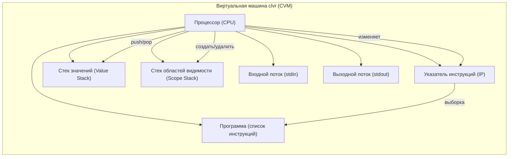

# Виртуальная машина clvr

Виртуальная машина **CVM** (Clvr Virtual Machine) выполняет инструкцию за инструкцией, реализуя семантику языка clvr. Данная спецификация описывает модель, структуру и набор инструкций CVM.

## Иллюстрация

Структура виртуальной машины:

## Представление данных
В CVM поддерживаются три типа:
- INT — 32-битное целое число со знаком.
- FLOAT — 64-битное число с плавающей точкой (IEEE 754).
- STRING — неизменяемая строка (UTF-8).

## Система инструкций
Ниже представлен полный список инструкций виртуальной машины clvr, соответствующий текущей реализации.

1. PushInt [Value] - Помещает целочисленный литерал [Value] на стек значений.
2. PushFloat [Value] - Помещает вещественный литерал [Value] на стек значений.
3. PushString [Value] - Помещает строковый литерал [Value] на стек значений.
4. Add - Снимает два значения со стека (EVAL[^2] и EVAL[^1]). Вычисляет EVAL[^2] + EVAL[^1]. 
   Оба операнда должны быть одного типа:
    - int + int = int
    - float + float = float
    - string + string = string (конкатенация)
    При несовпадении типов — ошибка выполнения. Результат помещается на стек.
5. Subtract - Снимает два значения (EVAL[^2] и EVAL[^1]). Вычисляет EVAL[^2] - EVAL[^1]. Только для чисел. Оба операнда должны быть одного типа. Результат помещается на стек.
6. Multiply - Снимает два значения. Вычисляет EVAL[^2] * EVAL[^1]. Только для чисел. Оба операнда должны быть одного типа. Результат на стек.
7. Divide - Снимает два значения. Вычисляет EVAL[^2] / EVAL[^1]. Только для чисел. Оба операнда должны быть одного типа.
    - Для int — целочисленное деление (дробная часть отбрасывается).
    - Для float — вещественное деление.
    Деление на ноль — ошибка.
8. Mod - Снимает два значения. Вычисляет EVAL[^2] % EVAL[^1]. Только для int. Деление на ноль — ошибка.
9. UnaryMinus - Снимает вершину стека (EVAL[^1]), которая должна быть числом. Помещает -значение того же типа на стек.
10. DefineVariable [VariableDefinition] - Создаёт новую переменную согласно [VariableDefinition]. Значение для переменной берётся с вершины стека (EVAL[^1]) и снимается.
    VariableDefinition содержит:
     - Name — имя переменной
     - Type — тип (Int / Float / String)
     - IsConstant — true (константа) или false (обычная переменная)
Ошибка, если переменная с таким именем уже существует в текущей области видимости.
11.  LoadVariable [Name] - Ищет переменную [Name] во всех активных областях видимости (от текущей к родительским). Если найдена, помещает её значение на стек. Ошибка, если переменная не существует.
12.  StoreVariable [Name] - Записывает значение с вершины стека (EVAL[^1]) в существующую переменную [Name] (поиск по всем областям). Переменная не должна быть константой (IsConstant = false). Значение снимается со стека. Ошибка, если переменная не найдена или является константой.
13.  Input [Name] - Читает строку из входного потока (stdin) через IRuntimeEnvironment.ReadLine(). Преобразует прочитанную строку к типу переменной [Name]:
    - Если переменная типа int — преобразует к целому числу.
    - Если float — преобразует к вещественному.
    - Если string — оставляет как есть.
Записывает полученное значение в переменную [Name]. Ошибка возникает, если:
     - переменная не существует;
     - переменная является константой;
     - входной поток завершился;
     - считанное значение нельзя преобразовать к типу переменной.
14.  Output - Снимает значение с вершины стека (EVAL[^1]) и выводит его текстовое представление в выходной поток (stdout) через IRuntimeEnvironment.Write().
15.  EnterScope - Создаёт новую пустую область видимости (новую таблицу переменных) поверх текущей. Используется при входе в блок [].
16.  ExitScope - Удаляет текущую область видимости. Все переменные, определённые в ней, теряются. Используется при выходе из блока []. Ошибка, если выполняется попытка удалить глобальную область видимости.
17.  Halt - Останавливает выполнение виртуальной машины.